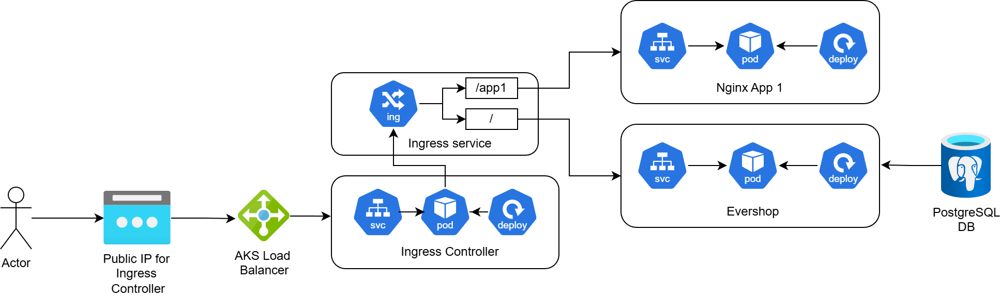

# Azure-Cloud-Technology

## Description

This is a simple web page named Evershop which is deployed in Azure Cloud environment. Evershop uses PostgreSQL as its database to store users' and products' information.

## Architecture



In this Azure cloud project, the user can access the webpage through public IP address using Ingress controller. AKS Load Balancer ultilizes ingress controller to map the service to either / or /app1.

## Terraform Manifest

Make sure to login to your azure account. To deploy the Evershop web in Azure, Azure resource group and AKS cluster need to be created. The resource group can be created running this terraform command:

```
cd terraform_manifest
terraform init
terraform apply
```

A resource group and AKS cluster will be created in Sweden Central. You can connect with the cluster by using this command:

```
az aks get-credentials --resource-group aks-rg2-dev --name aks-rg2-dev-cluster --overwrite-existing
```

Next you can deploy the app in AKS cluster Kubectl. The virtual machines will automatically scale up in AKS cluster.  

The deployment can be run with kubectl:

```
kubectl apply -f ./kube-manifests
```

You can check the pods by running this command:
```
kubectl get pods
```

You can check the pods by running this command:
```
kubectl get sv
```

You can check the deployments by running this command:
```
kubectl get deployments
```

You can check the persistent volumne by running this command:
```
kubectl get pvc
```

You can check the ingress by running this command:
```
kubectl get ingress
```

The deployment can be deleted with kubectl:
```
kubectl delete -f ./kube-manifests
```